# Red Cow Campaign - Decision Trees & Story Flows

Comprehensive Mermaid diagrams tracking all story branches and decision points in the campaign.

## Character Selection Flow

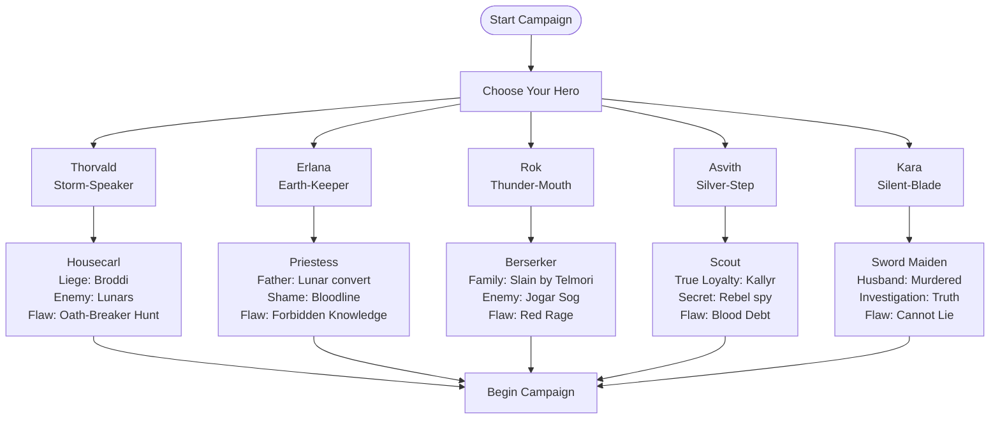

## 1618 - Year One Decision Tree

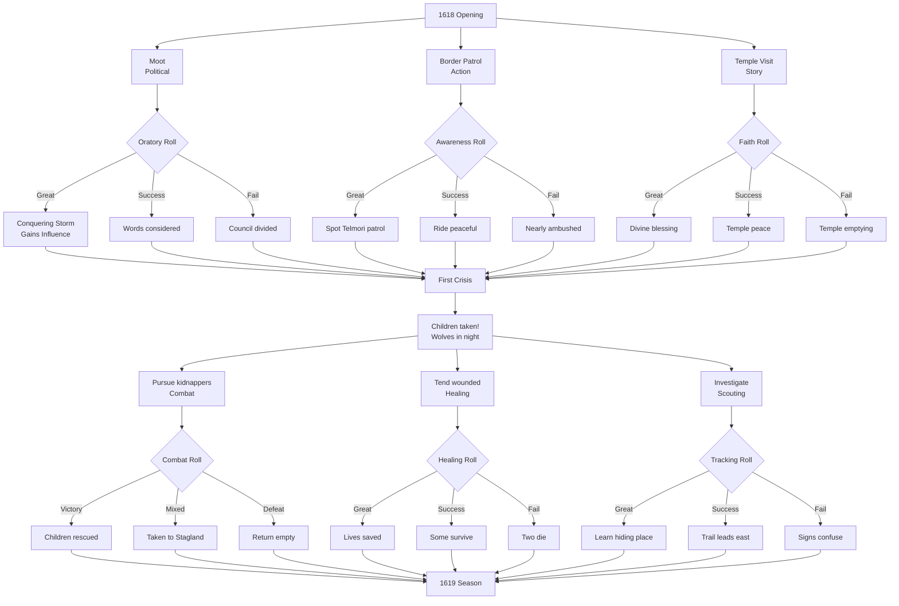

## Faction Influence Tree

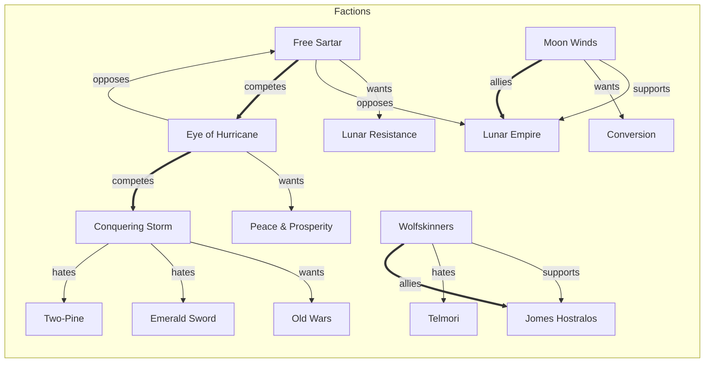

## Campaign Timeline Decision Points

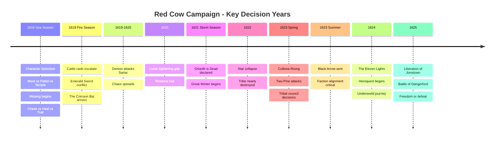

## NPC Relationship Web

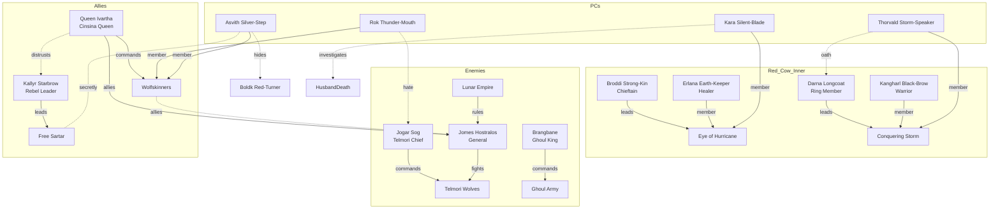

## Location Navigation Map

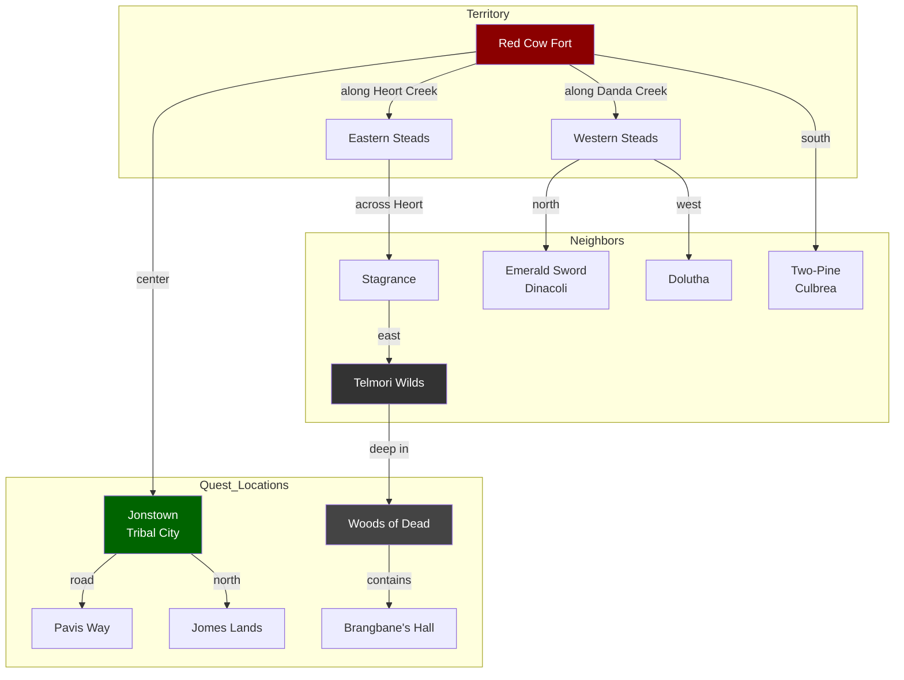

## PC Secret Missions

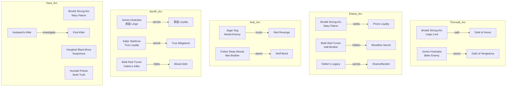

## QuestWorlds Combat System Flow

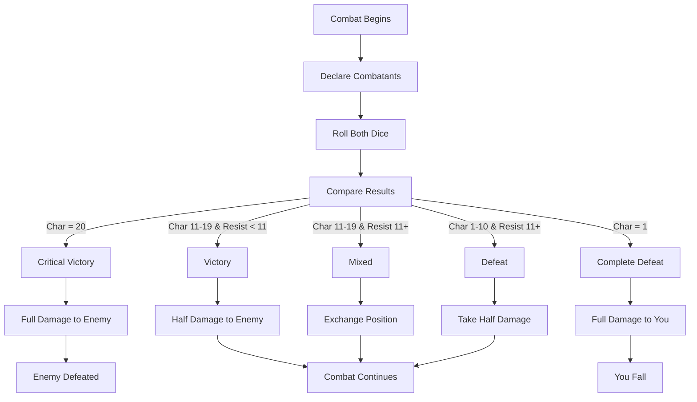

## QuestWorlds Skill Resolution

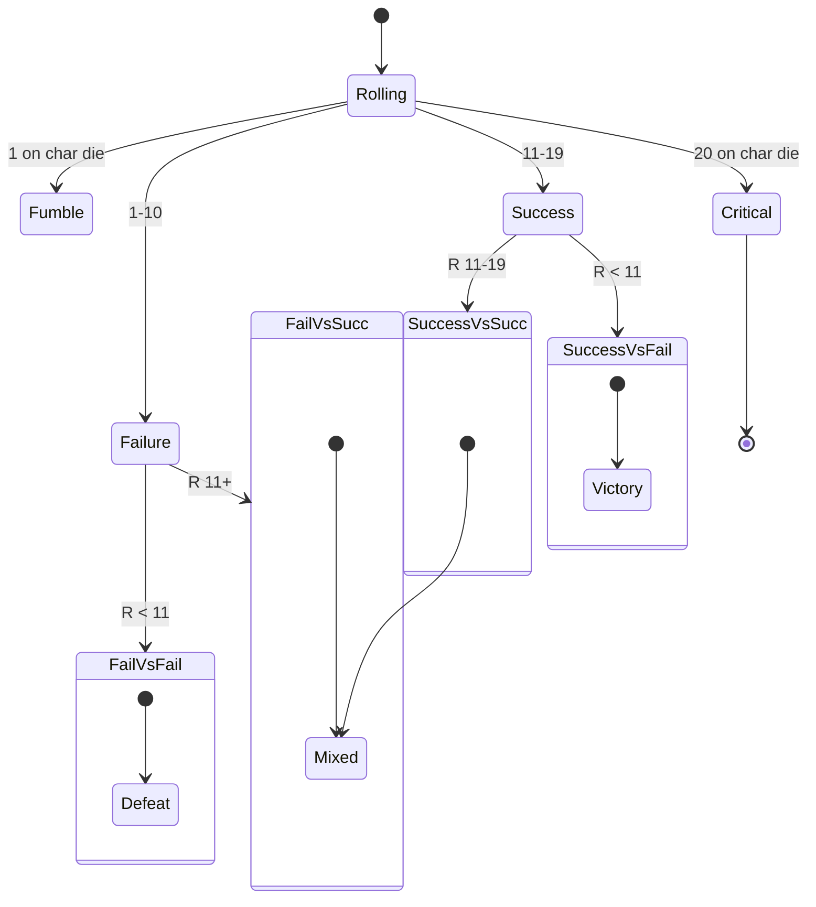

## Clan Resources System

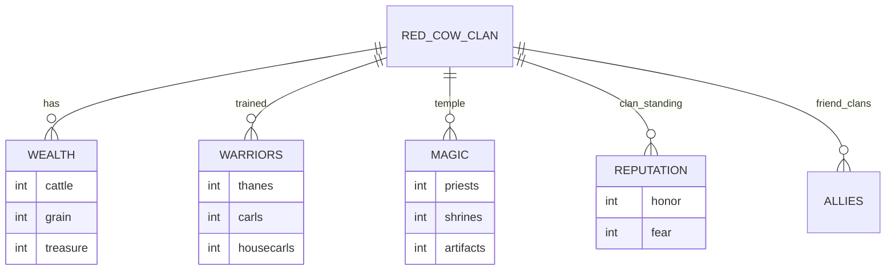

## Key Plot Points Summary

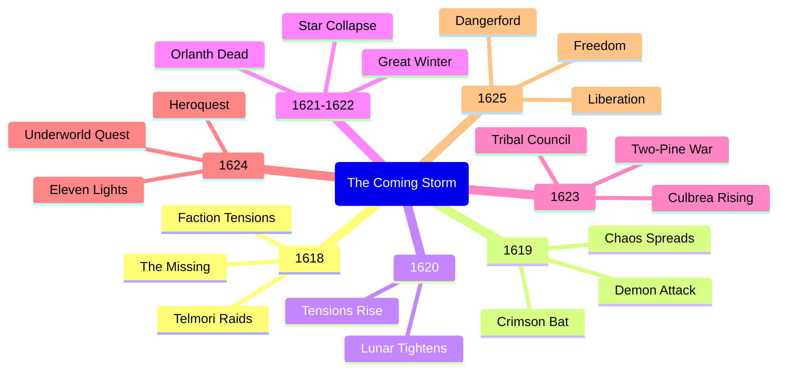

## Story Progression - Seasonal Flow

```mermaid
flowchart LR
    subgraph Year_1618
        A1[The Missing] --> A2[Telmori Raid]
        A2 --> A3[Kidnapped Children]
    end
    
    subgraph Year_1619
        B1[Bat Arrives] --> B2[Demon Attacks]
        B2 --> B3[Chaos Spreads]
    end
    
    subgraph Year_1620_1621
        C1[Orlanth Dead] --> C2[Great Winter]
        C2 --> C3[Star Collapse]
    end
    
    subgraph Year_1622
        D1[Winter Ends] --> D2[Crisis Aftermath]
    end
    
    subgraph Year_1623
        E1[Culbrea Rising] --> E2[Two-Pine War]
        E2 --> E3[Tribal Council]
    end
    
    subgraph Year_1624
        F1[Eleven Lights] --> F2[Heroquest]
        F2 --> F3[Quest Complete]
    end
    
    subgraph Year_1625
        G1[Liberation] --> G2[Dangerford Battle]
        G2 --> G3[Freedom]
    end
    
    A3 -->|"sets up"| B1
    B3 -->|"leads to"| C1
    C3 -->|"causes"| D1
    D2 -->|"leads to"| E1
    E3 -->|"leads to"| F1
    F3 -->|"culminates"| G1
```

## Interactive Branch Summary

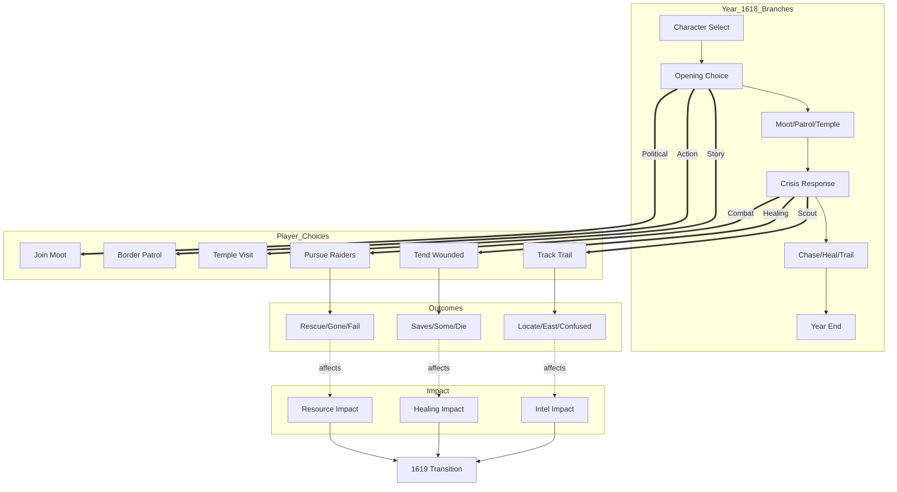

---

# Enhancement 1: Conditional Macro System

> Faction-aware macros that change outcomes based on PC choices and faction standing

## Faction-Aware Roll Macro

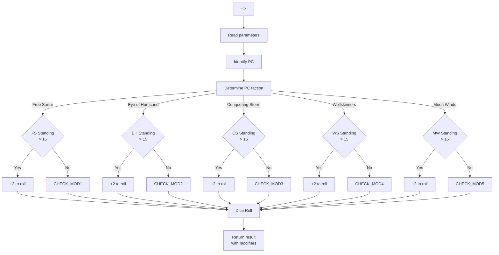

## Quest Unlock Macro

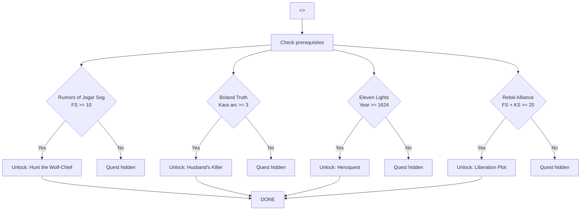

---

# Enhancement 2: Character Arc Milestones

> Track PC-specific progression through secret revelations and personal goals

## Thorvald Storm-Speaker Arc

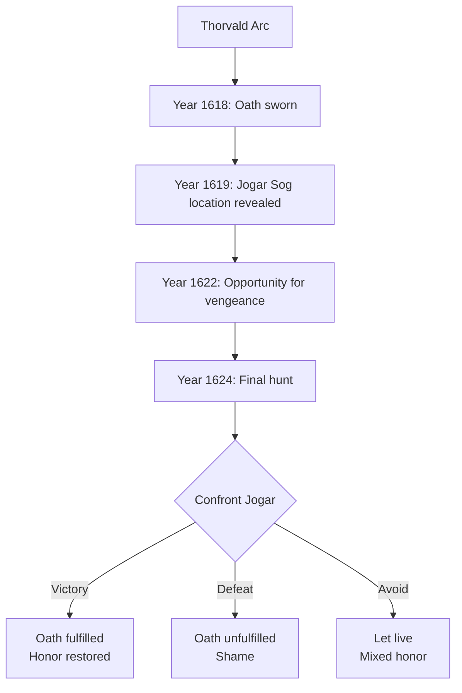

## Erlana Earth-Keeper Arc

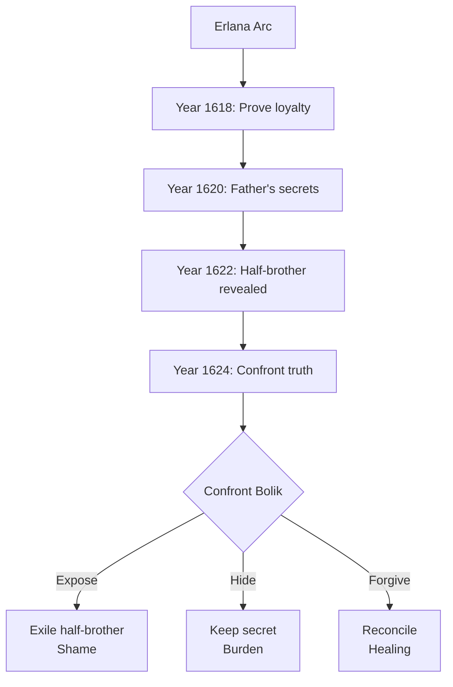

## Rok Thunder-Mouth Arc

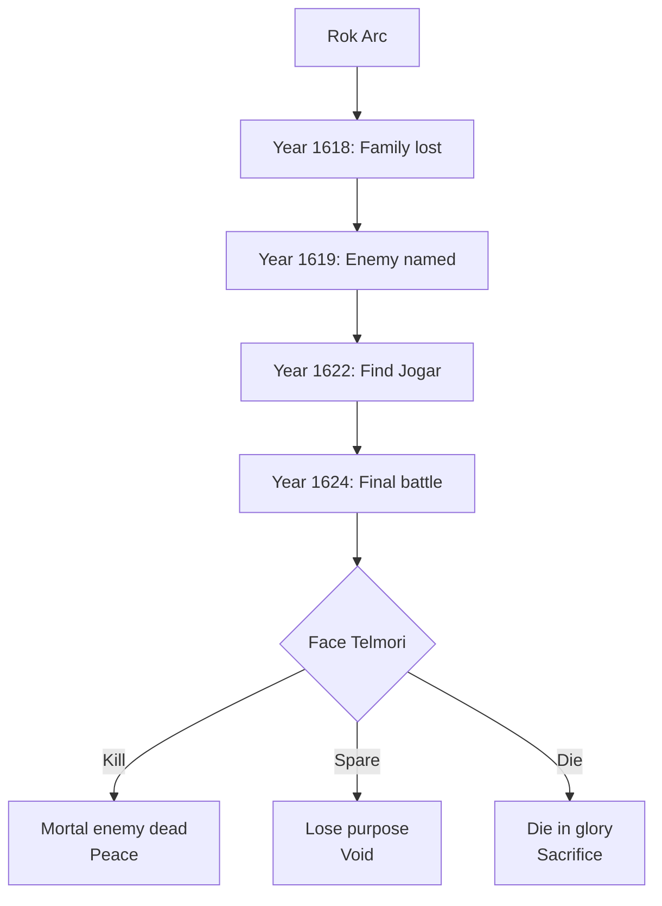

## Asvith Silver-Step Arc

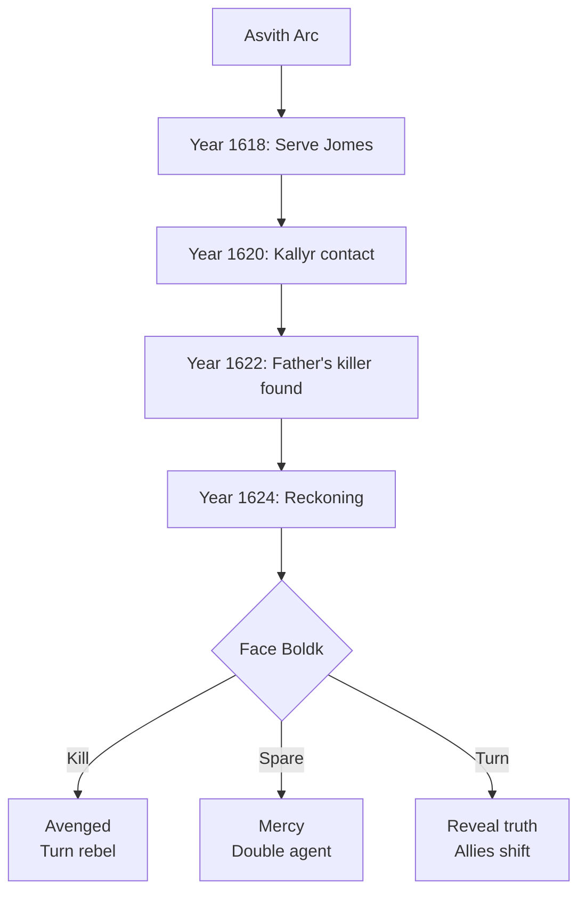

## Kara Silent-Blade Arc

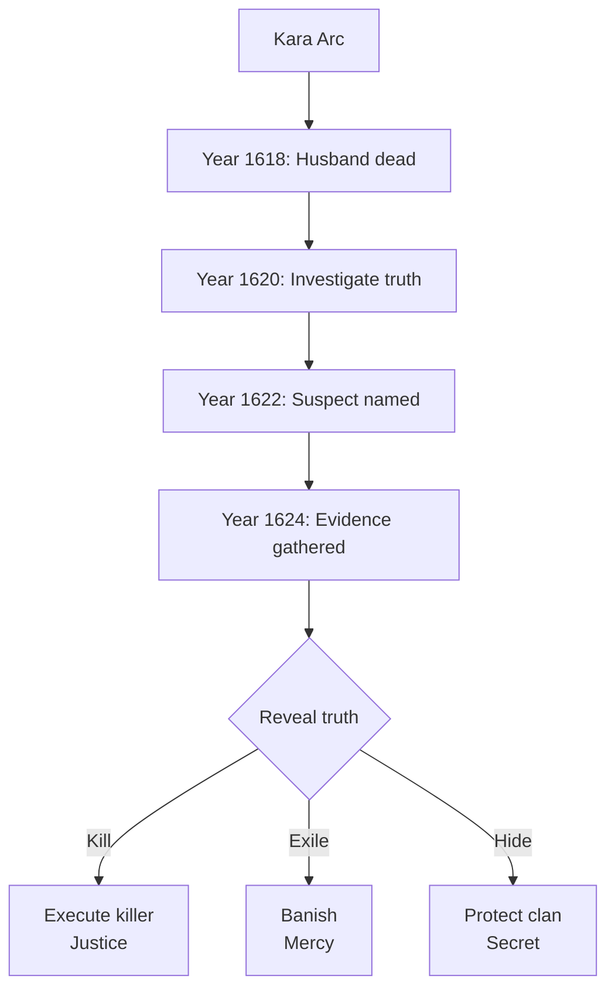

## Combined Arc Progression

```mermaid
timeline
    title PC Arc Completion Tracking
    1618
      : Thorvald: Oath sworn
      : Erlana: Prove loyalty
      : Rok: Family lost
      : Asvith: Serve Jomes
      : Kara: Husband dead
    1620
      : Thorvald: Trace enemy
      : Erlana: Father's secrets
      : Asvith: Kallyr contact
    1622
      : Thorvald: Hunt opportunity
      : Erlana: Half-brother
      : Rok: Find Jogar
      : Asvith: Boldk found
      : Kara: Suspect named
    1624
      : Thorvald: Final hunt
      : Erlana: Reckoning
      : Rok: Final battle
      : Asvith: Reckoning
      : Kara: Truth revealed
```

---

# Enhancement 3: Faction Standing Tracker

> Dynamic influence tracking affecting available quests and NPC interactions

## Faction Variables

```mermaid
erDiagram
    PC ||--o{ FACTION_STANDING : affects
    FACTION_STANDING {
        string factionName
        int standing
        int maxStanding
        int minStanding
    }
    FACTION_STANDING ||--o{ QUEST_UNLOCK : enables
    
    QUEST {
        string questName
        int requiredStanding
        string availableFrom
    }
```

## Faction Standing Effects

```mermaid
flowchart LR
    subgraph Faction_Standing_Boosts
        Moot[Moot speech] -->|"+2"| FS_PLUS[Free Sartar +]
        PatrolGood[Good patrol] -->|"+1"| WS_PLUS[Wolfskinners +]
        HealGood[Heal wounded] -->|"+1"| EH_PLUS[Eye of Hurricane +]
        AttackLunar[Lunar attack] -->|"+2"| CS_PLUS[Conquering Storm +]
        LunarHelp[Help Lunar] -->|"+2"| MW_PLUS[Moon Winds +]
    end
    
    subgraph Faction_Standing_Penalties
        MootFail[Failed speech] -->|"-1"| FS_MINUS
        PatrolFail[Failed patrol] -->|"-1"| WS_MINUS
        IgnoreCrisis[Ignore crisis] -->|"-2"| EH_MINUS
        RefuseCombat[Refuse fight] -->|"-1"| CS_MINUS
        RebelHelp[Help rebels] -->|"-2"| MW_MINUS
    end
    
    subgraph Standing_Thresholds
        FS_PLUS -->|"Standing >= 15"| FS_HIGH[Unlock rebel quests<br/>Meet Kallyr]
        WS_PLUS -->|"Standing >= 15"| WS_HIGH[Join wolf hunt<br/>Jomes trust]
        CS_PLUS -->|"Standing >= 15"| CS_HIGH[Lead raid<br/>Darna favor]
        EH_PLUS -->|"Standing >= 15"| EH_HIGH[Peace missions<br/>Broddi trust]
        MW_PLUS -->|"Standing >= 15"| MW_HIGH[Imperial favor<br/>Unlock Lunar quests]
    end
```

## Faction NPC Access

```mermaid
flowchart TD
    subgraph Free_Sartar_Access
        FS_10[Standing >= 10] --> FS_RUM[Access: Rumors]
        FS_15[Standing >= 15] --> FS_MEET[Meet: Kallyr Starbrow]
        FS_20[Standing >= 20] --> FS_JOIN[Join: Rebel band]
        FS_20 --> FS_INTEL[Intel: Lunar plans]
    end
    
    subgraph Wolfskinners_Access
        WS_10[Standing >= 10] --> WS_RUM[Access: Wolf patrols]
        WS_15[Standing >= 15] --> WS_MEET[Quest: Hunt Jogar]
        WS_20[Standing >= 20] --> WS_JOIN[Quest: Jomes secret]
    end
    
    subgraph Conquering_Storm_Access
        CS_10[Standing >= 10] --> CS_RUM[Access: Raids]
        CS_15[Standing >= 15] --> CS_MEET[Quest: Darna mission]
        CS_20[Standing >= 20] --> CS_JOIN[Lead: War party]
    end
    
    subgraph Eye_of_Hurricane_Access
        EH_10[Standing >= 10] --> EH_RUM[Access: Peace talks]
        EH_15[Standing >= 15] --> EH_MEET[Quest: Mediate]
        EH_20[Standing >= 20] --> EH_JOIN[Counsel: Broddi]
    end
    
    subgraph Moon_Winds_Access
        MW_10[Standing >= 10] --> MW_RUM[Access: Lunar news]
        MW_15[Standing >= 15] --> MW_MEET[Quest: Temple help]
        MW_20[Standing >= 20] --> MW_JOIN[Convert: Secret]
        MW_20 --> MW_INTEL[Lunar secrets]
    end
```

---

# Enhancement 5: Multiple Ending Paths

> Distinct conclusions based on PC choices and faction alignment

## Ending Decision Tree

```mermaid
flowchart TD
    START[1625 Ending] --> CHECK_ALL[Check all conditions]
    
    CHECK_ALL --> COND1{FS >= 20<br/>WS >= 15}
    COND1 -->|"Yes"| LIB_SUCCESS[Liberation Success]
    COND1 -->|"No"| CHECK_2
    
    CHECK_2 --> COND2{MW >= 20<br/>Lunar favor high}
    COND2 -->|"Yes"| COMP_SUCCESS[Compromise Success]
    COND2 -->|"No"| CHECK_3
    
    CHECK_3 --> COND3{Resources <= 5<br/>No allies}
    COND3 -->|"Yes"| EXILE[Exile Ending]
    COND3 -->|"No"| FINAL_CHANCE[Final Battle]
    
    FINAL_CHANCE --> ROLL{Military roll}
    ROLL -->|"Victory"| LIB_SUCCESS
    ROLL -->|"Defeat"| EXILE
    ROLL -->|"Mixed"| COMP_SUCCESS
    
    LIB_SUCCESS --> END_L[Freedom Ending:<br/>Sartar liberated]
    COMP_SUCCESS --> END_C[Collab Ending:<br/>Survival with Lunars]
    EXILE --> END_E[Exile Ending:<br/>Clan scattered]
```

## Freedom Ending Branch

```mermaid
flowchart TD
    FREE[Freedom Ending] --> F1["Year 1625:<br/>Dangerford Battle"]
    F1 --> F2{Combat Victory}
    F2 -->|"Yes"| F3[Lunar defeated]
    F2 -->|"No"| F4[Peace treaty]
    
    F3 --> F5[Jonstown freed]
    F4 --> F5
    F5 --> F6["Kallyr assumes<br/>power]
    F6 --> F7{"Support Kallyr"}
    
    F7 -->|"Yes"| F8[Republic ending:<br/>New Sartar]
    F7 -->|"No"| F9[ monarchy ending:<br/>Queenship]
    
    F8 --> EPILOGUE_F[Epilogue:<br/>PCs as heroes]
    F9 --> EPILOGUE_F
```

## Collaboration Ending Branch

```mermaid
flowchart TD
    COLLAB[Collaboration Ending] --> C1["Year 1625:<br/>Negotiate]
    C1 --> C2{Terms accepted}
    C2 -->|"Yes"| C3[Lunar terms]
    C2 -->|"No"| C4[Exile instead]
    
    C3 --> C4["Clan survives<br/>Under Lunar rule]
    C4 --> C5["PCs granted<br/>positions]
    C5 --> C6{"Accept posts"}
    
    C6 -->|"Yes"| C7[Official career:<br/>Serve Empire]
    C6 -->|"No"| C8[Quiet life:<br/>Withdraw]
    
    C7 --> EPILOGUE_C[Epilogue:<br/>Mixed legacy]
    C8 --> EPILOGUE_C
```

## Exile Ending Branch

```mermaid
flowchart TD
    EXILE[Exile Ending] --> E1["Year 1625:<br/>Clan falls]
    E1 --> E2[Red Cow destroyed]
    E2 --> E3[Scattered survivors]
    E3 --> E4["PCs escape<br/>to wilderness]
    E4 --> E5["Form outlaw<br/>band]
    E5 --> E6{"Join rebels"}
    
    E6 -->|"Yes"| E7[Continue fight:<br/>Guerrilla war]
    E6 -->|"No"| E8[New life:<br/>Elsewhere]
    
    E7 --> EPILOGUE_E1[Epilogue:<br/>Ever fighting]
    E8 --> EPILOGUE_E2[Epilogue:<br/>New beginning]
```

## Ending Effects Summary

```mermaid
mindmap
  (Multiple Endings)
    Freedom Ending
      Kallyr liberated
      PCs as heroes
      New Sartar Republic
    Collaboration Ending
      Survive under Lunar
      Mixed legacy
      Quiet service
    Exile Ending
      Outlaw band
      New beginning
      Endless fight
```

## Epilogue NPCs by Ending

```mermaid
flowchart LR
    subgraph Freedom_Epilogue
        FE[Freedom Ending] --> FE1[Queen Ivartha]
        FE --> FE2[Kallyr Starbrow]
        FE --> FE3[Free Sartar]
        FE --> FE4[Rebel leaders]
    end
    
    subgraph Collab_Epilogue
        CE[Collab Ending] --> CE1[Jomes Hostralos]
        CE --> CE2[Lunar priests]
        CE --> CE3[Imperial officials]
        CE --> CE4[Moon Winds]
    end
    
    subgraph Exile_Epilogue
        EE[Exile Ending] --> EE1[Venharl Stormbrow]
        EE --> EE2[Orstalor Spearlord]
        EE --> EE3[Outlaw camps]
        EE --> EE4[Hidden rebels]
    end
```

---

## Notes

- **Year tracking**: Global variable `$year` (1618-1625)
- **Season tracking**: Sea/Fire/Earth/Dark/Storm
- **Resource decay**: Background events each season
- **Faction influence**: Player actions affect faction standing
- **Character arcs**: Each PC has year-specific story beats
- **Multiple endings**: Based on PC choices and faction alignment