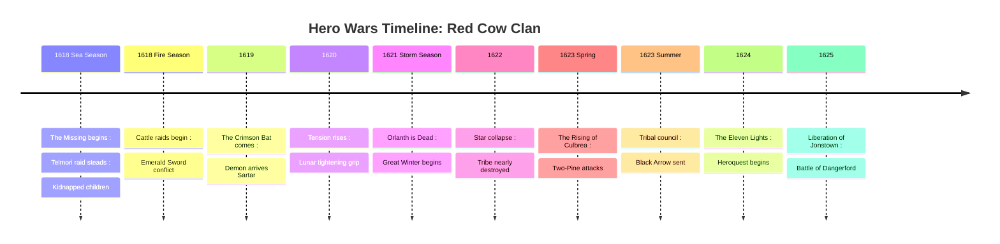
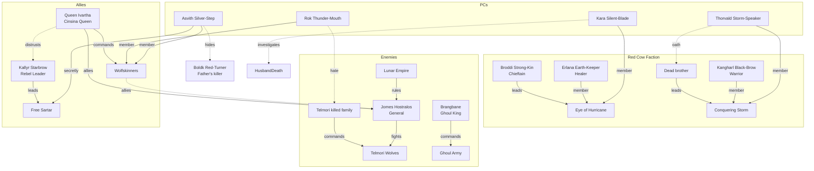
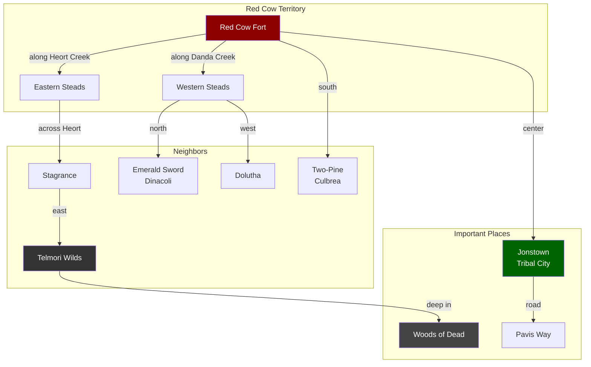
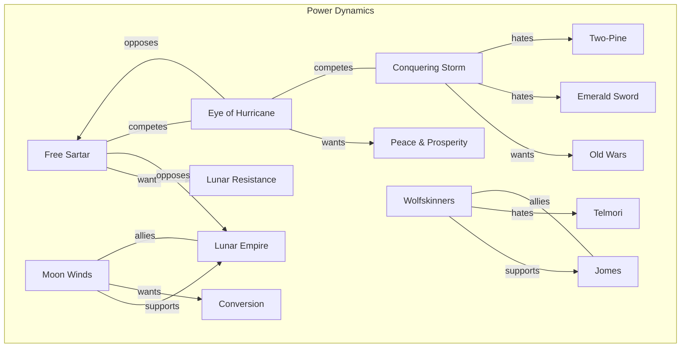
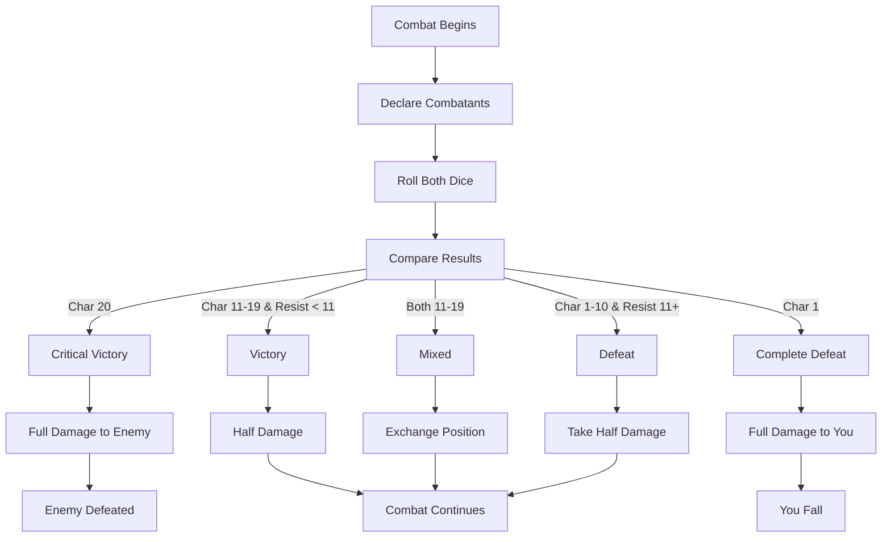
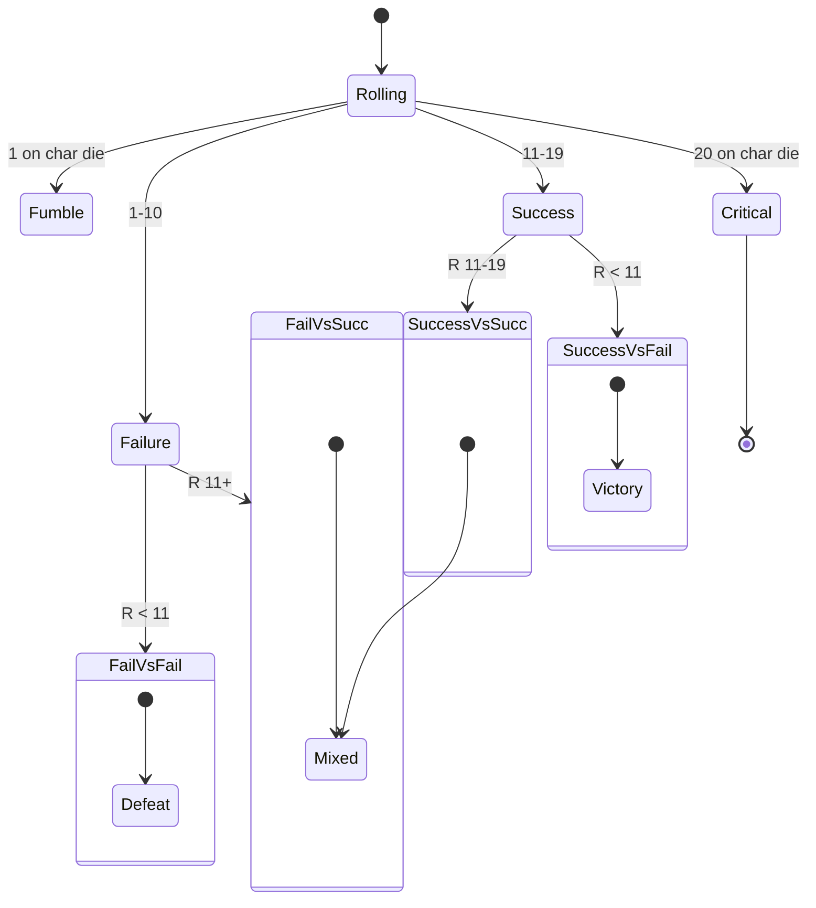
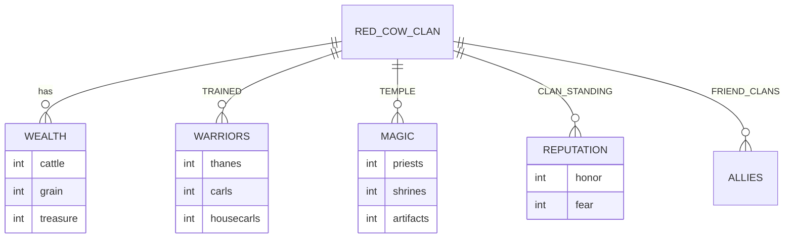
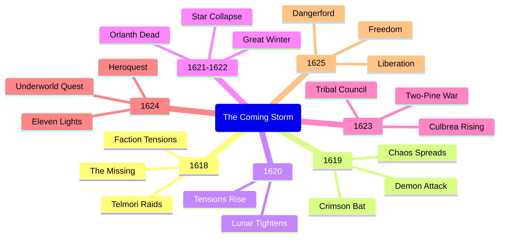

# Red Cow Campaign - Mermaid Diagrams

> Reference diagrams for the complete campaign story and character connections.

## Campaign Timeline (1618-1625)



## Character & Faction Relationships



## PC Connections to Key NPCs

```mermaid
graph TD
    subgraph Thorvald Storm-Speaker
        T1["Broddi Strong-Kin<br/>Liege Lord"]
        T2["Darna Longcoat<br/>Political Ally"]
        T3["Jomes Hostralos<br/>Bitter Enemy"]
    end

    subgraph Erlana Earth-Keeper
        E1["Broddi Strong-Kin<br/>Wary Patron"]
        E2["Mother Griselda<br/>Temple Superior"]
        E3["Bolik Red-Turner<br/>Half-Brother"]
    end

    subgraph Rok Thunder-Mouth
        R1["Jomes Hostralos<br/>Grudging Ally"]
        R2["Frekor Deep-Woods<br/>War-Brother"]
        R3["Jogar Sog<br/>Mortal Enemy"]
    end

    subgraph Asvith Silver-Step
        A1["Jomes Hostralos<br/>表面 Liege"]
        A2["Kallyr Starbrow<br/>True Loyalty"]
        A3["Bolik Red-Turner<br/>Blood Enemy"]
    end

    subgraph Kara Silent-Blade
        K1["Broddi Strong-Kin<br/>Wary Patron"]
        K2["Kangharl Black-Brow<br/>Suspicious"]
        K3["Humakt Priests<br/>Teachers"]
```

## Story Flow - Year by Year


## Location Map - Red Cow Lands



## Faction Influence Map



## Combat Resolution Flow



## QuestWorlds Dice Results



## Resource Tracking



## Key Plot Points Summary



## Notes for Implementation

- **Year tracking**: Global variable $year (1618-1625)
- **Season tracking**: Sea/Fire/Earth/Dark/Storm
- **Resource decay**: Background events each season
- **Faction influence**: Player actions affect faction standing
- **Character arcs**: Each PC has year-specific story beats
- **Multiple endings**: Based on PC choices and faction alignment